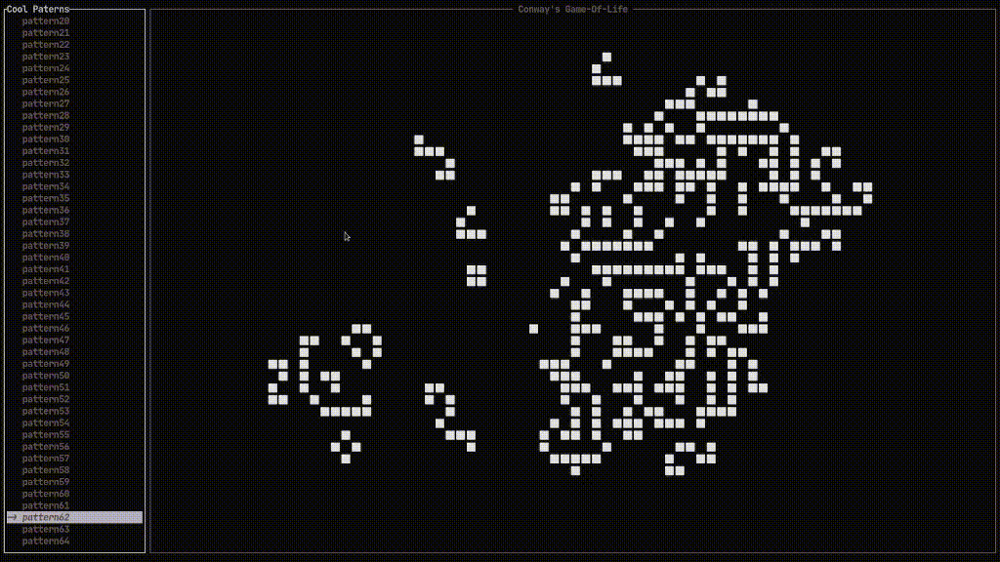
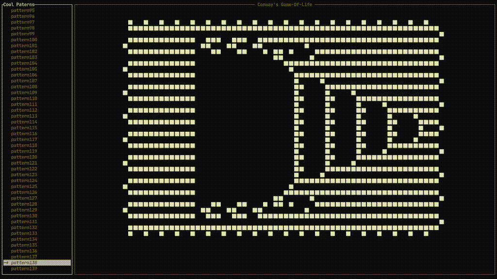

# Contorols
* a: play animation
* n: next generation
* s: stop
* j or down arrow: go down next pattern (note: you have to stop the animation to browse the patterns)
* k or up arrow: go up next pattern

